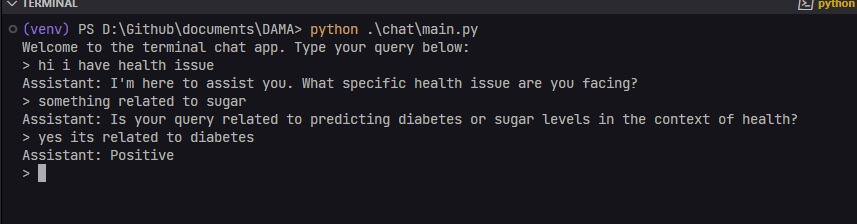
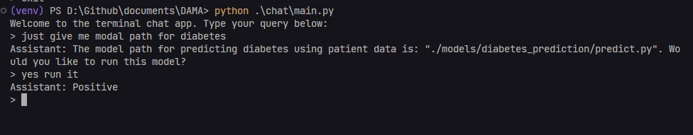

# Domain-Aware Model Augmentation: Integrating Specialized Models for Improved LLM Performance

In the rapidly evolving field of artificial intelligence, deploying machine/deep learning models is crucial for maximizing AI capabilities. This paper outlines a comprehensive framework for deploying deep learning models using AI APIs, focusing on integration, efficiency, and practical applications.

## Setup Virtual Environment

To set up the virtual environment, follow these steps:

### For Windows:
```bash
Create the virtual env: python -m venv venv
Activate virtual env: ./venv/Scripts/activate
```

### For macOS/Linux:
```bash
python3 -m venv venv
source venv/bin/activate
```

## Install Requirements

After activating the virtual environment, install the required packages:

```bash
pip install -r requirements.txt
```

## How to Run

To start the application, run the following command:

```bash
python chat/main.py
```

## Testing

We use `pytest` for testing the application. To run tests, use the following commands:

### Run Tests:
```bash
pytest
```

### Run Tests with Debugging:
```bash
pytest -s
```

## Explanation of the Flow:

1. Environment Setup:
   - Environment variables are managed securely using `dotenv`.
   - Models metadata is loaded from a JSON file, containing information about various machine learning models available for execution.

2. ConversationBufferMemory:
   - This component tracks and stores conversation history between the user and the assistant, allowing the assistant to maintain context across multiple interactions for more accurate and relevant responses.

3. Function to Run the Model:
   - The `run_model(model_path)` function is designed to execute a Python script located at the specified `model_path`.
   - It uses `subprocess.run` to run the script as an independent process. The script's output is captured and returned to the user.
   - If the script executes successfully, the standard output (`stdout`) is returned. If there is an error, the standard error (`stderr`) is captured and returned instead.

4. Function Calling Structure:
   - The `function_definitions` list defines the `run_model` function for the OpenAI API, specifying the function name, description, and expected parameters.
   - This structure enables the assistant to dynamically decide when to execute this function based on the user's query.

5. Processing User Queries:
   - When a user query is received, the `get_completion` function processes the query by sending it to the OpenAI API along with the function definitions and conversation history.
   - The assistant analyzes the query and determines whether a function call is necessary. If the model identifies that a specific model should be run, it triggers the `run_model` function with the appropriate `model_path`.
   - If the response directly includes a model path (e.g., `./models/diabetes_prediction/predict.py`), the script at that path is executed, and its output is returned to the user.

test line:

- just give me model path for diabetes





## References:

https://platform.openai.com/docs/guides/function-calling?lang=python

https://python.langchain.com/v0.1/docs/modules/memory/types/buffer/
